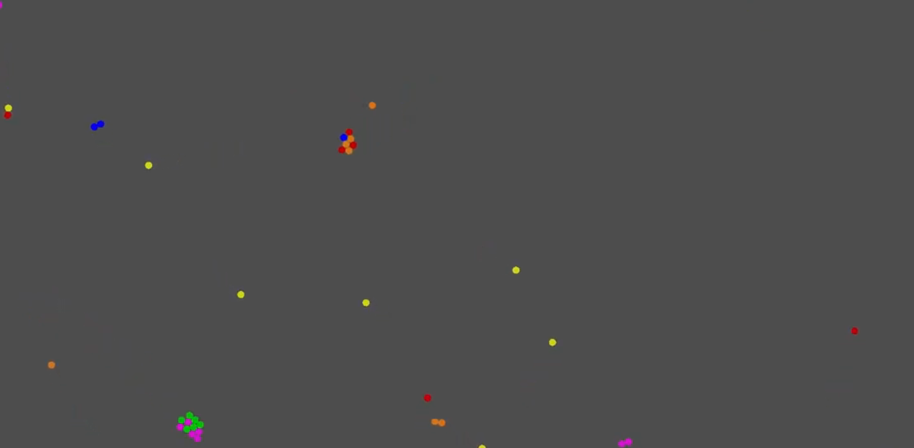
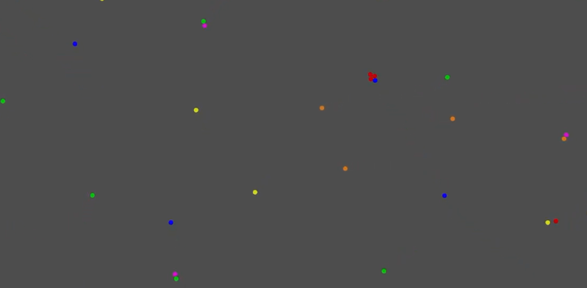
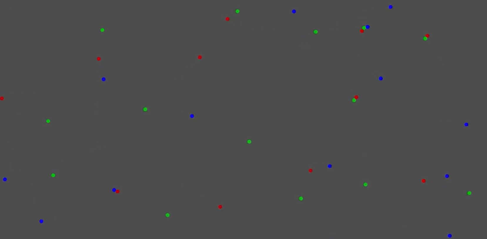
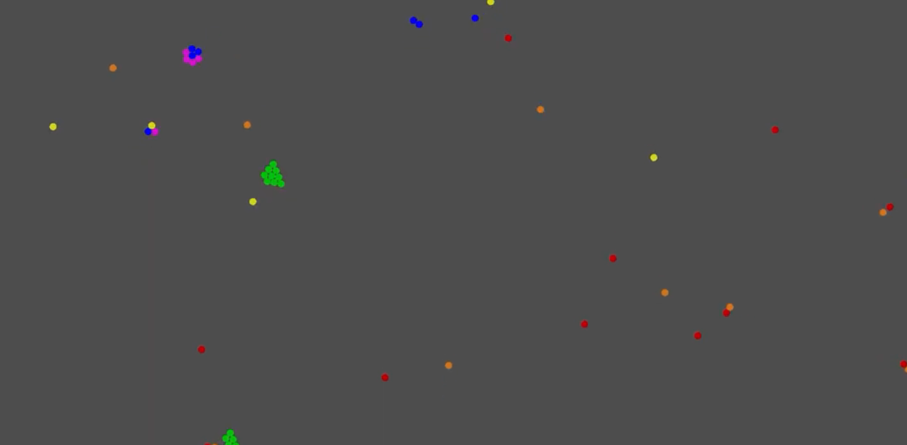
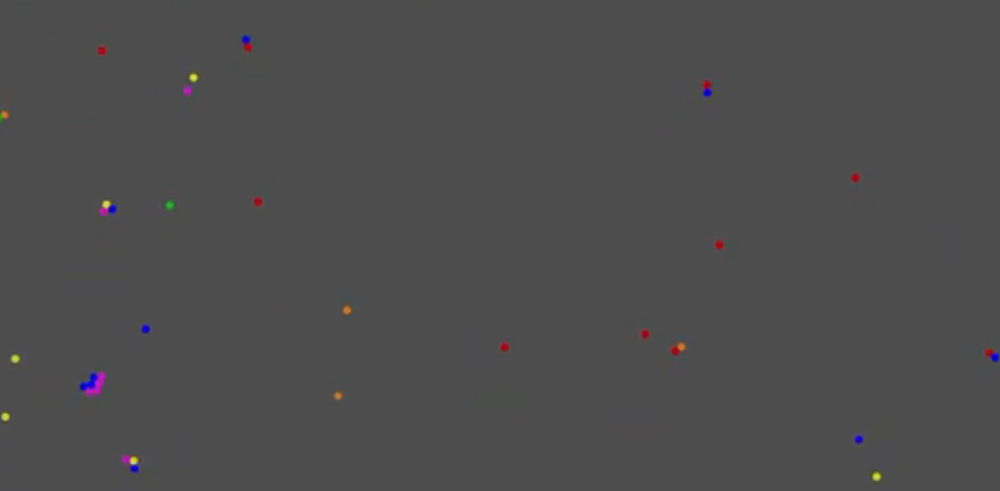

# Dot Simulator

## Introduction

These dots above this text, believe it or not, move (only when the program's actually running)! With a program I wrote in Godot, a game engine (and some help from my dad), the different colours have random attractions and repulsions towards each other, making them move around, eventually looking like real life lifeforms. This is the incredible... Dot Simulator!

## My Story

This program didn't actually start on Godot. In fact, I started where all humble school programers do, on Scratch. Eventually, I moved to Godot, as the program was incredibly hard to write on Scratch. But I actually had to LEARN Godot first, as I had no experience. But it got there in the end, or you wouldn't be seeing this right now.

### Scratch

My journey started on Scratch, an incredibly easy to learn, very basic, blockbased, programing language. for a while, I finnicked around with what I should do, eventually landing on a particle life simulator. So I started coding. I was about halfway through when I realized that my program was incredibly buggy and barely worked. I decided to restart, but instead on Godot.

### Learning Godot

Because we are limited to Chromebooks at school, I had to load Godot through Linux, another operating system that can run inside a Chromebook. I started doing the GDQuest training course, later moving on to "My First 2D Game", inside Godot Docs. After learning the basics, I started coding the game.

### The Final Product

I coded the rest of the project in Godot. You can access the code by going into the "Code" tab above.

## Results

I have shared some of the best simulation results that I have found, so here they are:

### Video 1

Here is the video (click on the image):

One of the mechanics in this is the basic attraction and repulsion. You can see that the pink dots attract other pink dots making them cluster together. The same with the green dots. The green dots are also attracted to pinks, but the pinks are repulsed by the greens, though not as much as the geens are attracted to pinks. This means that the greens stick to the pinks but the pink try in vain to get away, pursued by the greens, catapulting the entire cluster forward. At one point, all the pinks are clustered with almost every green behind. This bulldozer cassually batted multiple blues out of the way.

### Video 2

Same for this one:

A feature that is notable here is the collision. For this project I used the CollisionShape2D node. When this node is attached to a RigidBody2D (I used this for the dots), it means that the collision shapes can't overlap.

### Video 3

And this:

Something here is the ability to quickly and easily change the amount of dots and the different colours in the simulation. This is important because, as you may have noticed, there are only three colours in this video!

### Video 4

And so forth:

Something else to note is the way I created the colours. I used the _draw function inside the RigidBody2D's code to draw the circle for each dot. This allows extreme adabtility of the colour, instead of having to create a whole new Sprite2D every time you want to adjust the colour by a semitone.

### Video 5

Last of all:

In this sim, you may have noticed the tendency to organize into smaller groups than in other videos. To be sure, I'm not sure why this happens, but I call it a feature, not a bug. It might be because there is more repulsion than attraction in this sim (the attraction and repulsion is completely random).

### Link to project

You can run the project in chrome by following this link: https://bennytnz.github.io/Godot-Dot-Simulator/Index.html, however, the web version is a LOT laggier than in Godot and doesn't always work.

### How I Got to Github

Accessing Github, to be honest, was a mess involving my home account (I didn't go on it in school) and the shared files system between the accounts (Github is normally blocked). I typed this up on Visual Studio Code, again through Linux.

##  A Huge Thank You For My Dad

I got a lot of help from my dad, including using Linux and using Godot, I also use his Youtube channel for the videos. He is a progammer for a living, which helped a lot. However, the code is all mine and I didn't use any AI tools. Thank you Dad!

## Conclusion

It has been a huge challenge creating this project and learning Godot at the same time, but I have immensely enjoyed it. Thank you for viewing this!

###### By Ben Stevenson, Torea 13
